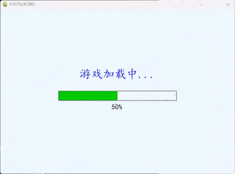
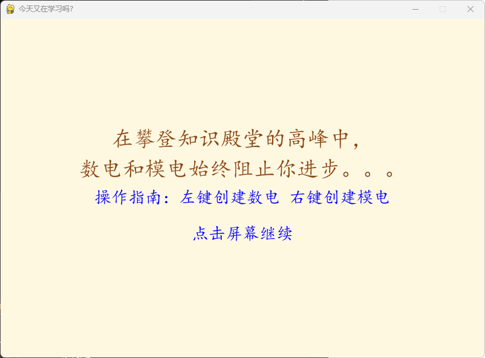
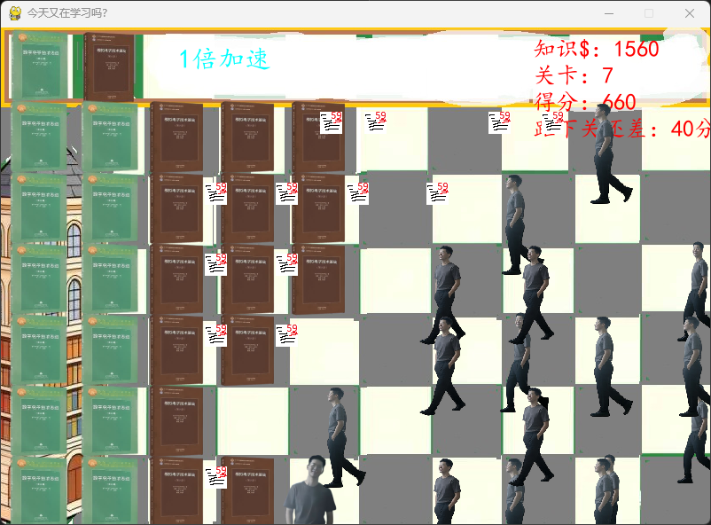
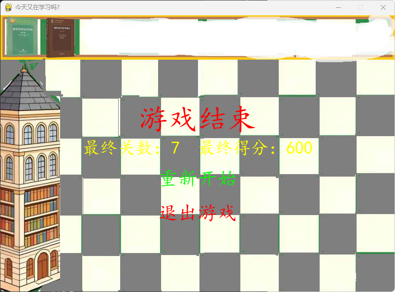

# Python 课程设计报告：Pygame 游戏开发（类植物大战僵尸）

**课程名称：**Python 程序设计

**学号：**[********]

**姓名：**[***]

**同组成员（如有）：**[无] (分工：[无])

**提交日期：**2025年12月31日

---

## 1. 项目背景与目标

随着Python编程学习的深入，单纯的语法练习已难以满足实战能力提升的需求。为巩固面向对象编程思想，熟练掌握Pygame库的图形绘制、事件处理、动画实现等核心技能，本项目开发了一款融合“学习”主题的2D塔防游戏。游戏模仿《植物大战敌人》核心玩法，以“数电”“模电”作为防御/经济单位，实现了完整的游戏流程与交互逻辑。项目既兼顾了趣味性，又能有效解决Python实战练习场景不足的问题，帮助深入理解游戏开发的核心思路与实现方法。

## 2. 系统设计

### 2.1 技术栈选型

- **开发语言：**Python 3.8

- **GUI 框架：**Pygame（负责窗口管理、图形绘制、事件响应、动画渲染）

- **数据存储：**无（轻量游戏，无需持久化存储，所有状态均为运行时内存存储）

- **外部接口/库：**Pygame（核心游戏开发库）、random（随机生成敌人位置）、time（控制资源加载延迟）

### 2.2 功能模块说明

1. **资源预加载模块：**分步加载游戏所需图片资源，提供进度条实时反馈，支持资源加载失败降级（纯色块替代），避免游戏崩溃。

2. **游戏单位管理模块：**管理数电（经济单位）、模电（防御单位）、敌人（敌方单位）、试卷（攻击道具）的创建、状态更新与绘制。

3. **碰撞交互模块：**实现多组碰撞检测（试卷-敌人、敌人-数电/模电），触发伤害计算、关卡推进、单位销毁、格子状态重置等逻辑。

4. **倍速控制模块：**支持1倍/2倍速即时切换，通过全局速度因子同步所有动态元素速度，保证游戏节奏调整的流畅性与一致性。

5. **游戏流程管控模块：**管控“加载界面→剧情指南界面→主游戏循环→结束界面”全流程，支持游戏重新开始时的状态完全重置。

## 3. 核心代码解析 (关键环节)
### 3.1 核心功能：资源预加载（带进度反馈与异常降级）

```python

def preload_resources(self):
    # 定义基础资源列表（名称、路径、加载失败备用颜色）
    basic_resources = [
        ('tushuguan', IMAGE_PATH + 'tushuguan.png', (0,255,0)),
        ('shudian', 'imgs/shudian.png', (255,255,0)),
        ('modian', 'imgs/modian.png', (0,255,0)),
        ('shijuan', 'imgs/shijuan.png', (255,0,0)),
        ('zombie', 'imgs/zombie.png', (128,128,128))
    ]
    zombie_walk_paths = [IMAGE_PATH + f'zombie_walk{i}.png' for i in range(1,5)]
    total = len(basic_resources) + 1  # 总加载任务数（基础资源+敌人动画帧）
    current_progress = 0

    # 加载基础资源，异常时用对应尺寸纯色块替代
    for name, path, fallback_color in basic_resources:
        try:
            RESOURCES[name] = pygame.image.load(path)
        except pygame.error as e:
            print(f"加载{name}失败: {e}，使用备用色块")
            # 按单位类型设置备用色块尺寸
            size = (80,80) if name != 'zombie' else (80,120)
            RESOURCES[name] = pygame.Surface(size)
            RESOURCES[name].fill(fallback_color)
        current_progress += 1
        yield int((current_progress)/total * 100)  # 返回当前加载进度
        time.sleep(0.2)  # 模拟加载延迟，提升用户感知

    # 加载敌人行走帧动画
    fallback_surface = pygame.Surface((80, 120))
    fallback_surface.fill((128,128,128))
    for frame_path in zombie_walk_paths:
        try:
            frame = pygame.image.load(frame_path)
            frame = pygame.transform.scale(frame, (80, 120))
            RESOURCES['zombie_walk_frames'].append(frame)
        except pygame.error as e:
            print(f"加载敌人行走帧失败: {e}，使用备用色块")
            RESOURCES['zombie_walk_frames'].append(fallback_surface.copy())
    current_progress += 1
    yield int((current_progress)/total * 100)
    time.sleep(0.2)
```

**代码原理解析：**本模块采用生成器函数实现资源分步加载，核心优势是“进度实时反馈+异常降级容错”。通过生成器的yield关键字，每加载完成一个资源就返回当前进度（0-100），配合加载界面可实现进度条动态更新；同时，用try-except捕获Pygame图片加载异常，当资源缺失或路径错误时，自动创建对应尺寸和颜色的纯色块作为备用资源，避免游戏直接崩溃，极大提升了程序的健壮性。生成器的使用还避免了一次性加载导致的启动黑屏卡顿问题。

### 3.2 核心功能：敌人帧动画流畅实现（状态联动）

```python

def update_zombie_animation(self):
    # 敌人存活且行走状态：循环切换4帧动画
    if self.live and not self.stop:
        self.animation_timer += 1
        # 达到动画切换阈值时更新帧索引（循环取模实现无限动画）
        if self.animation_timer >= self.animation_speed:
            self.current_frame = (self.current_frame + 1) % 4
            self.image = self.walk_frames[self.current_frame]
            self.animation_timer = 0
    # 敌人存活但停止状态（啃食单位）：恢复基础静态图
    elif self.live and self.stop:
        self.image = self.original_zombie
        self.animation_timer = 0
        self.current_frame = 0

def display_zombie(self):
    # 先更新动画状态，再绘制敌人，确保动画与绘制同步
    self.update_zombie_animation()
    MainGame.window.blit(self.image, self.rect)
```

**代码原理解析：**帧动画实现的核心是“计时器控制+状态联动”。通过current_frame（当前帧索引）、animation_timer（动画计时器）、animation_speed（切换阈值）三个变量精准控制动画节奏，避免出现切换过快或卡顿问题；同时，严格区分“行走”和“停止”两种状态，行走时每累计15帧切换一次帧（%4实现4帧循环），停止时立即重置为基础静态图，确保动画状态与敌人行为完全匹配。绘制前先调用动画更新方法，保证每帧显示的都是最新动画状态，实现流畅的视觉效果。

### 3.3 核心功能：倍速功能全局同步实现

```python

class MainGame():
    # 全局速度因子（1倍速默认，2倍速为切换后状态）
    game_speed = 1

    def deal_events(self):
        eventList = pygame.event.get()
        for e in eventList:
            # 倍速按钮点击事件：即时翻转速度因子
            if e.type == pygame.MOUSEBUTTONDOWN:
                if self.speed_btn_rect.collidepoint(e.pos):
                    MainGame.game_speed = 2 if MainGame.game_speed == 1 else 1

    def start_game(self):
        # 游戏主循环
        while not GAMEOVER:
            # 其他核心逻辑：绘制地图、更新单位、处理事件...
            
            # 动态计算帧延迟：速度因子越大，延迟越短，帧频率越高
            delay_time = 10 // MainGame.game_speed
            pygame.time.wait(delay_time)  # 控制每帧间隔
            pygame.display.update()
```

**代码原理解析：**倍速功能的核心是“全局速度因子+动态帧延迟”，实现“一处修改，全局同步”。首先定义game_speed作为全局速度开关，点击按钮可直接翻转其值（1/2切换），无需重启游戏；然后在主循环中，帧延迟delay_time与速度因子绑定（delay_time = 10 // game_speed），2倍速时帧延迟从10ms缩短为5ms，主循环执行频率翻倍。由于游戏中所有动态逻辑（敌人移动、数电产钱、模电射击等）均依赖主循环帧数推进，帧频率翻倍后，所有元素同步加速，且不会出现“部分元素加速、部分匀速”的错乱问题，保证了倍速切换的流畅性与一致性。

## 4. 遇到的重难点与解决思路 (必填)


### 困难 1：敌人动画卡顿与状态错乱

- **问题描述：**初始实现敌人动画时，存在两个问题：一是动画切换速度过快，视觉上严重卡顿；二是敌人啃食单位（停止状态）时，仍在播放行走动画，状态与行为不匹配。

- **分析过程：**动画卡顿是因为未设置计时器，每帧都切换帧索引，切换频率过高；状态错乱是因为未将动画更新逻辑与敌人的“停止”状态绑定，动画更新与行为脱节。

- **解决方案：**1. 新增animation_timer计时器和animation_speed切换阈值，只有计时器累计到指定帧数（15帧）才切换帧索引，精准控制动画节奏；2. 新增stop状态标记，在动画更新方法中判断状态：行走时播放循环动画，停止时立即重置为基础静态图；3. 绘制敌人前先调用动画更新方法，确保动画状态与绘制同步，解决卡顿问题。

### 困难 2：倍速功能部分元素不同步

- **问题描述：**最初尝试直接修改敌人移动速度实现倍速，但导致数电产钱、模电射击仍保持原速度，出现“敌人快、生产慢”的逻辑错乱，破坏游戏平衡。

- **分析过程：**游戏动态逻辑分为“每帧固定移动”和“计时器累计触发”两类，单独修改某类元素的速度会导致逻辑脱节；且直接修改元素基础速度会增加代码耦合度，后续扩展或维护困难。

- **解决方案：**1. 定义全局速度因子game_speed，所有动态逻辑均依赖该因子，不修改任何元素的基础速度值；2. 帧延迟与速度因子绑定，倍速时缩短帧延迟，提升主循环频率，间接带动所有依赖帧数的逻辑同步加速；3. 倍速切换逻辑封装在事件处理中，点击按钮即时翻转速度因子，无需重启循环，保证切换流畅。

### 困难 3：碰撞交互逻辑混乱导致状态异常

- **问题描述：**游戏存在多组碰撞交互（试卷-敌人、敌人-单位），初始将所有碰撞逻辑写在同一处，导致代码耦合过紧，出现敌人卡在啃食状态、单位死亡后格子无法重新放置的问题。

- **分析过程：**多组碰撞逻辑混杂会导致职责不明确，比如敌人啃食单位后未正确重置stop状态，或格子can_grow状态未联动更新，进而引发连锁状态异常。

- **解决方案：**1. 分层拆分碰撞逻辑：试卷与敌人的攻击交互放在Shijuan类的hit_zombie方法，敌人与单位的被攻击交互放在Zombie类的hit_unit方法，职责明确；2. 用live属性标记单位存活状态，遍历单位时用列表切片[:]避免删除元素导致的索引错乱；3. 单位死亡后，通过坐标计算对应地图块位置，重置can_grow状态，同时重置敌人stop状态，确保逻辑闭环。

## 5. 项目运行展示






## 6. 总结与反思

- **不足之处：**1. UI界面较为简陋，未进行精细化美化，如地图块、单位的视觉效果单一，缺乏音效反馈（放置单位、射击、游戏结束等场景无音效）；2. 游戏功能较为基础，仅实现核心塔防玩法，缺少扩展内容（如多种敌人类型、增益道具、多地图切换等）；3. 未实现游戏存档功能，无法保存关卡进度，重启游戏需重新开始。

- **心得体会：**1. 通过本次项目，深入理解了Python面向对象编程的核心思想，熟练掌握了类的封装、继承与多态在实战中的应用，实现了代码的高复用性与低耦合度；2. 系统掌握了Pygame库的核心功能，包括窗口创建、图形绘制、事件处理、动画实现、碰撞检测等，提升了游戏开发的实战能力；3. 学会了如何分析与解决项目开发中的异常问题，如资源加载失败、逻辑状态错乱等，培养了程序健壮性设计的思维；4. 深刻认识到“模块化设计”与“逻辑分层”的重要性，合理的代码结构能极大提升开发效率与后续维护的便利性。

## 7. 附录：源码地址

- GitHub 链接：[https://github.com/Dr-Choas/python-_l-.git]
- 运行说明：1. 下载源码后，在项目根目录创建imgs文件夹，放入所需图片资源（或直接使用备用色块功能）；2. 安装依赖：pip install pygame；3. 执行game.py文件即可启动游戏。
